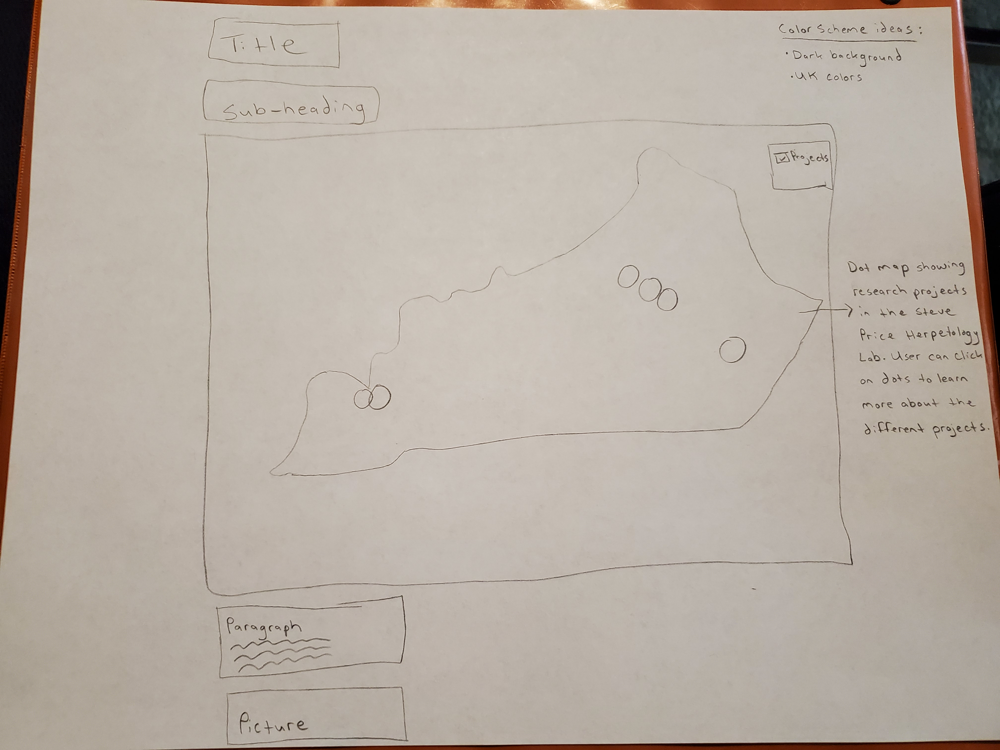

### HerpetologyLab

# Herpetology Lab at the University of Kentucky

## Data Source

For my final project, I'm using data from the Price Lab webpage (https://pricelab.ca.uky.edu/) through the Department of Forestry and Natural Resources at the University of Kentucky.

## Map Topic

Dr. Price is a professor within the Department of Forestry and Natural Resources at the University of Kentucky. His research focuses on ecology and conservation of semi-aquatic and aquatic organisms in Kentucky and surrounding states.

### Anticipated methods of thematic representation methods and user interface 

Dot map showing different research projects in Kentucky and other states. Pop-ups outlining research projects (title, years, description). Upon mouseover, projects will change color and on mouse-out, they will re-set to original style. There will be a toggle button to turn off projects layer.

### Mockups

## Map Objectives and User Needs

This map is necessary to highlight research in the Herpetology Lab at the University of Kentucky. This lab has many recent and active projects, most of which have associated publications (https://pricelab.ca.uky.edu/publications). It is vital to disseminate information within a research field. 

I'm designing this map because I am a Research Analyst in the Price lab and thus I'm familiar with Dr. Price and his research projects. I myself am a conservation biologist who is passionate about preserving wildlife, paticularly herpetofauna. I have 10+ years of experience working with threatened and endangered species.

I expect the user of this map to be researchers (i.e., principal investigators, graduate students), state agencies, and the general public (i.e., naturalists). I would expect user needs to be variable. For example, graduate students would be interested in the description of projects to narrow down their graduate search for a potential advisor. Non-profits, on the other hand, might be more interested in using the information for a public outreach tool (i.e., "Have you seen this critter?"). State agencies may be interested in the information while they create their State Wildlife Action Plans to conserve wildlife.

## Technology Stack

I created a geoJSON using an outline of one from a previous module. I included information I needed such as project title, years, and a project description. I used Leaflet as my JS library.

## STRATEGY PLANE 

I want to see a visual representation of research projects in the Price Lab. I want to be able to easily access information for different research projects in the Price Lab. I want to make a product that could be usable for different users (researchers, graduate students, non-profits, etc.) to spread information about research projects in the Price Lab.

## SCOPE PLANE

I will access data from the Price Lab webpage through the Department of Forestry and Natural Resources at the University of Kentucky. From there, I will manipulate data to make a geoJSON (using a previous module as a template). 

## STRUCTURE PLANE

A title and sub-heading will be above the map. Below the map will be a paragraph outlining some background information. There will be a photo as well. The map will have a toggle option. See mockups for more information.

## SKELETON PLANE

 There will be pop-ups detailing individual research projects (title, years, description). Further, I would like to have a mouseover/mouseout UI where the dots change color (mouseover) and reset (mouseout).

## SURFACE PLANE

This is intended to be informational. I hope to share some information about Price Lab research projects with the users.

## Article citations

For additional information about the research projects outlined in this map, check out this webpage: https://pricelab.ca.uky.edu/publications